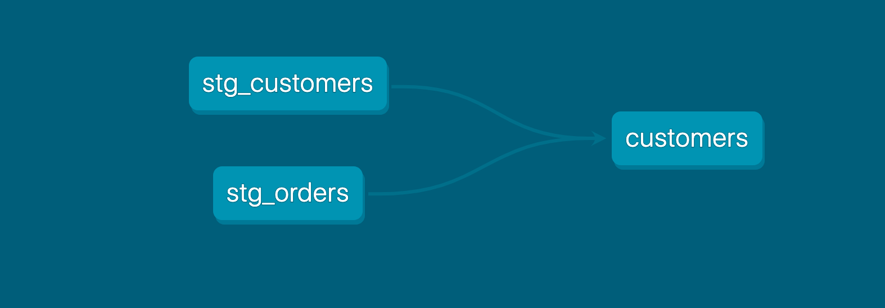

As a best practice in SQL, you should separate logic that cleans up your data from logic that transforms your data. You have already started doing this in the existing query by using common table expressions (CTEs).

Now you can experiment by separating the logic out into separate models and using the ref function to build models on top of other models:




Create a new SQL file, models/stg_customers.sql, with the SQL from the customers CTE in our original query.

Create a second new SQL file, models/stg_orders.sql, with the SQL from the orders CTE in our original query.

```sql
--models/staging/stg_customers.sql
select
    id as customer_id,
    first_name,
    last_name

from raw.jaffle_shop.customers
```

```sql
-- models/staging/stg_orders.sql
select
    id as order_id,
    user_id as customer_id,
    order_date,
    status

from raw.jaffle_shop.orders
```

models/marts/core/customers.sql
```sql
with customers as (

    select * from {{ ref('stg_customers') }}

),

orders as (

    select * from {{ ref('stg_orders') }}

),

customer_orders as (

    select
        customer_id,

        min(order_date) as first_order_date,
        max(order_date) as most_recent_order_date,
        count(order_id) as number_of_orders

    from orders

    group by 1

),

final as (

    select
        customers.customer_id,
        customers.first_name,
        customers.last_name,
        customer_orders.first_order_date,
        customer_orders.most_recent_order_date,
        coalesce(customer_orders.number_of_orders, 0) as number_of_orders

    from customers

    left join customer_orders using (customer_id)

)

select * from final
```

```bash
dbt run
```