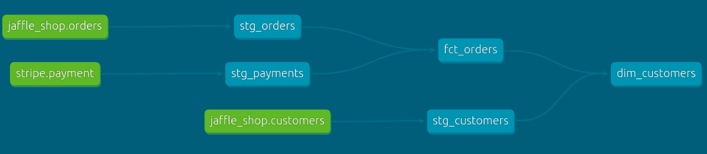

## Build models on top of sources

Sources make it possible to name and describe the data loaded into your warehouse by your extract and load tools. By declaring these tables as sources in dbt, you can:

select from source tables in your models using the {{ source() }} function, helping define the lineage of your data
test your assumptions about your source data
calculate the freshness of your source data



```sql
-- models/stg_customers1.sql
select
    id as customer_id,
    first_name,
    last_name

from {{ source('jaffle_shop', 'customers') }}
```

```sql
-- models/stg_orders1.sql
select
    id as order_id,
    user_id as customer_id,
    order_date,
    status

from {{ source('jaffle_shop', 'orders') }}
```

```sql