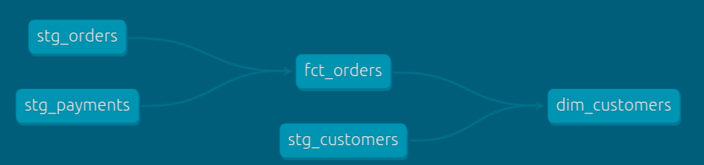

## Building a fct_orders Model

This part is designed to be an open ended exercise - see the exemplar on the next page to check your work.

    Use a statement tab or Snowflake to inspect raw.stripe.payment
    Create a stg_payments.sql model in models/staging/stripe
    Create a fct_orders.sql (not stg_orders) model with the following fields.  Place this in the marts/core directory.
        order_id
        customer_id
        amount (hint: this has to come from payments)




```sql
--staging/stripe/stg_payments.sql
select
    id as payment_id,
    orderid as order_id,
    paymentmethod as payment_method,
    status,

    -- amount is stored in cents, convert it to dollars
    amount / 100 as amount,
    created as created_at

from raw.stripe.payment 
```

```sql
-- marts/core/fct_orders.sql
with orders as  (
    select * from {{ ref('stg_orders' )}}
),

payments as (
    select * from {{ ref('stg_payments') }}
),

order_payments as (
    select
        order_id,
        sum(case when status = 'success' then amount end) as amount

    from payments
    group by 1
),

final as (

    select
        orders.order_id,
        orders.customer_id,
        orders.order_date,
        coalesce(order_payments.amount, 0) as amount

    from orders
    left join order_payments using (order_id)
)

select * from final
```
```sql
marts/core/dim_customers.sql 
with customers as (
    select * from {{ ref('stg_customers')}}
),
orders as (
    select * from {{ ref('fct_orders')}}
),
customer_orders as (
    select
        customer_id,
        min(order_date) as first_order_date,
        max(order_date) as most_recent_order_date,
        count(order_id) as number_of_orders,
        sum(amount) as lifetime_value
    from orders
    group by 1
),
final as (
    select
        customers.customer_id,
        customers.first_name,
        customers.last_name,
        customer_orders.first_order_date,
        customer_orders.most_recent_order_date,
        coalesce(customer_orders.number_of_orders, 0) as number_of_orders,
        customer_orders.lifetime_value
    from customers
    left join customer_orders using (customer_id)
)
select * from final
```
