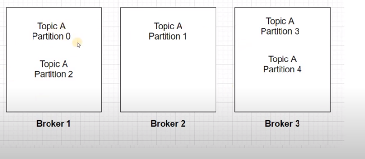

## multiple brokers

### configuration
```bash
# zookeeper started

# **Start Kafka-server**
F:/kafka_2.12-3.2.0/bin/windows/kafka-server-start.bat F:/kafka_2.12-3.2.0/config/server.properties

F:/kafka_2.12-3.2.0/bin/windows/zookeeper-shell.bat localhost:2181 ls /brokers/ids

F:/kafka_2.12-3.2.0/bin/windows/kafka-server-start.bat F:/kafka_2.12-3.2.0/**config/server1.properties** (uncomment listeners listeners=PLAINTEXT://:**9092**)

F:/kafka_2.12-3.2.0/bin/windows/kafka-server-start.bat F:/kafka_2.12-3.2.0/config**/server2.properties** uncomment listeners listeners=PLAINTEXT://:**9093**

F:/kafka_2.12-3.2.0/bin/windows/kafka-server-start.bat F:/kafka_2.12-3.2.0/config/**server3.properties** (uncomment listeners listeners=PLAINTEXT://:**9094** )
# **Create a topic**
F:/kafka_2.12-3.2.0/bin/windows/kafka-topics.bat –create –topic demo_testing2 –bootstrap-server **localhost:9092,localhost:9093,localhost:9094** –replication-factor 1 –partitions 5

F:/kafka_2.12-3.2.0/bin/windows/kafka-topics.bat –bootstrap-server localhost:9092,localhost:9093,localhost:9094 –describe –topic demo_testing2
# **Start Produce**
F:/kafka_2.12-3.2.0/bin/windows/kafka-console-producer.bat –topic demo_testing2 –bootstrap-server **localhost:9092,localhost:9093,localhost:9094
# Start Consumer**
F:/kafka_2.12-3.2.0/bin/windows/kafka-console-consumer.bat –topic demo_testing2 –from-beginning –bootstrap-server **localhost:9092,localhost:9093,localhost:9094**
```

### distributed  partitions brokers



- when you use kafka cluster with multiple brokers then **partitions are distributed across brokers**
- replication factor is how many copies of the data we want to have
- leader is the node responsible for all reads and writes for the given partition
- follower is the node that follows the leader instructions 
    - **when we stop server 1 the leader of partition 0 is moved to other server**