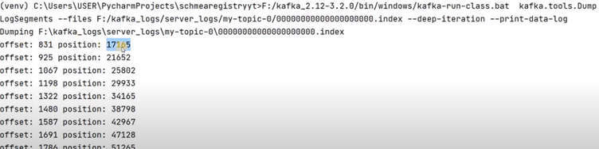

## index_timeindex

### index & timeindex files
Why do .index & .timeindex files exist in the kafka-log directory? .index & .timeindex files exist in the kafka-log directory because it is used to store the offset of the messages.

Kafka allows consumers to start fetching messages from any available offset. In order to help brokers quickly locate the message for a given offset, Kafka maintains two indexes for each segment: An offset to position index (in .index file)- It helps Kafka know what part of a segment to read to find a message A timestamp to offset index (in .timeindex file)- It allows Kafka to find messages with a specific timestamp

### example 1

```bash
## Start Zookeeper:

F:/kafka_2.12-3.2.0/bin/windows/zookeeper-server-start.bat F:/kafka_2.12-3.2.0/config/zookeeper.properties

## Start Kafka Server:

F:/kafka_2.12-3.2.0/bin/windows/kafka-server-start.bat F:/kafka_2.12-3.2.0/config/server.properties

```

```bash
## Producer Code:
from time import sleep
from json import dumps
from kafka import KafkaProducer

topic_name='my-topic'
producer = KafkaProducer(bootstrap_servers=['localhost:9092'],value_serializer=lambda x: dumps(x).encode('utf-8'))

for e in range(10000):
    data = {'number' : e}
    print(data)
    producer.send(topic_name, value=data)
```

#### Inspecting the .index file:

F:/kafka_2.12-3.2.0/bin/windows/kafka-run-class.bat kafka.tools.DumpLogSegments –files F:/kafka_logs/server_logs/my-topic-0/00000000000000000000.index –deep-iteration –print-data-log



<aside>
📌 When in .index file data is written?

F:/kafka_2.12-3.2.0/bin/windows/kafka-configs.bat –entity-type topics –entity-name my-topic –describe –all –bootstrap-server localhost:9092

#### Inspect .timeindex File

F:/kafka_2.12-3.2.0/bin/windows/kafka-run-class.bat kafka.tools.DumpLogSegments –files F:/kafka_logs/server_logs/my-topic-0/00000000000000000000.timeindex –deep-iteration –print-data-log

**in .timeindex we find the timestamp and offset of the messages**

</aside>

### example 2
- Experiment 2
    
    <aside>
    ➡️ Change log.segment.bytes from 1073741824 to 1000
    
    Clean the logs
    
    </aside>
    
    ```bash
    ## Start Zookeeper:
    
    F:/kafka_2.12-3.2.0/bin/windows/zookeeper-server-start.bat F:/kafka_2.12-3.2.0/config/zookeeper.properties
    
    ## Start Kafka Server:
    
    F:/kafka_2.12-3.2.0/bin/windows/kafka-server-start.bat F:/kafka_2.12-3.2.0/config/server.properties
    
    ## Create the topic:
    
    F:/kafka_2.12-3.2.0/bin/windows/kafka-topics.bat –bootstrap-server localhost:9092 –create –topic my-topic –partitions 1 –replication-factor 1 –config index.interval.bytes=10
    ```
    
    ```bash
    from time import sleep
    from json import dumps
    from kafka import KafkaProducer
    
    topic_name='my-topic'
    producer = KafkaProducer(bootstrap_servers=['localhost:9092'],value_serializer=lambda x: dumps(x).encode('utf-8'))
    
    for e in range(100000):
        data = {'number' : e}
        print(data)
        producer.send(topic_name, value=data)
    ```
    
    ```bash
    ## Inspect the log file:
    
    F:/kafka_2.12-3.2.0/bin/windows/kafka-run-class.bat 
    kafka.tools.DumpLogSegments 
    –files F:/kafka_logs/server_logs/my-topic-0/00000000000000000000.log 
    –deep-iteration –print-data-log
    ```