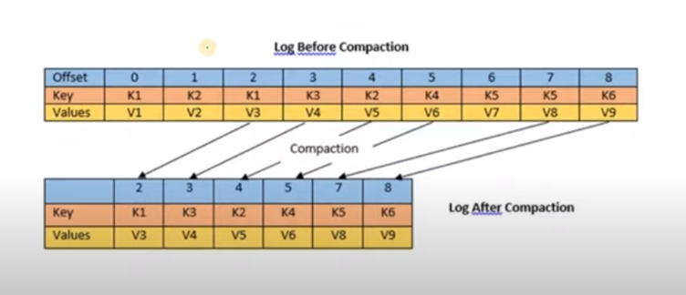

## log compaction
log_compaction is a feature of Kafka that allows old messages to be deleted after a period of time. This feature is useful for Kafka topics that are used as a buffer for data that is being consumed by a downstream system. For example, if you have a topic that is used to buffer messages for a consumer that is performing batch processing, you may want to delete messages from the topic after they have been consumed by the batch process. This will allow you to **keep the size of the topic small and prevent it from growing indefinitely**.



```bash
# kafka on ec2
wget https://dlcdn.apache.org/kafka/3.4.0/… tar -xvf kafka_2.13-3.4.0.tgz
# install Java
java -version sudo yum install java-1.8.0-openjdk java -version cd kafka_2.13-3.4.0
# start zookeeper
bin/zookeeper-server-start.sh config/zookeeper.properties
# Start Kafka-server Duplicate the session & enter in a new console 
export KAFKA_HEAP_OPTS=“-Xmx256M -Xms128M” 
cd kafka_2.13-3.4.0
bin/kafka-server-start.sh config/server.properties
```

<aside>
📌 It is pointing to private server , **change server.properties** so that it can run in **public IP**

To do this , you can follow any of the 2 approaches shared belwo – 
1)Do a vi config/server.properties in insert mode – change ADVERTISED_LISTENERS to public ip of the EC2 instance 
2)You can modify the file using Winscp also

</aside>

```bash
#To create Log Compacted Topic
# config cleanup.policy=compact is used to enable log compaction
# config min.cleanable.dirty.ratio=0.001 is used to set the minimum ratio of dirty log to #clean the log
# config segment.ms=5000 is used to set the time after which the log is compacted
cd kafka_2.13-3.4.0
bin/kafka-topics.sh 
–create –topic demo_testing3 
–bootstrap-server 54.90.61.129:9092 
–replication-factor 1 
–partitions 1 
–config cleanup.policy=compact 
–config min.cleanable.dirty.ratio=0.001 –
config segment.ms=5000
```

 

```bash
## To Start the Producer:

bin/kafka-console-producer.sh –topic demo_testing3 
–bootstrap-server 54.90.61.129:9092
–property parse.key=true
–property key.separator=,

## To Start the Consumer:

cd kafka_2.13-3.4.0 
bin/kafka-console-consumer.sh 
–topic demo_testing3 
–from-beginning 
–bootstrap-server 54.90.61.129:9092 
–property print.key=true 
–property key.separator=,
```