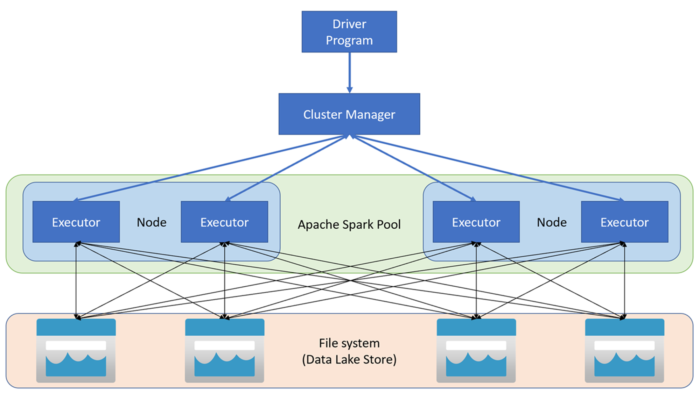

## spark
Spark is a fast and general cluster computing system for Big Data. It provides high-level APIs in Scala, Java, Python, and R, and an optimized engine that supports general computation graphs for data analysis. It also supports a rich set of higher-level tools including Spark SQL for SQL and structured data processing, MLlib for machine learning, GraphX for graph processing, and Spark Streaming for stream processing.

**How Spark works**

Apache Spark applications run as independent sets of processes on a cluster, coordinated by the *SparkContext* object in your main program (called the driver program). The SparkContext connects to the cluster manager, which allocates resources across applications using an implementation of Apache Hadoop YARN. Once connected, Spark acquires executors on nodes in the cluster to run your application code.

The SparkContext runs the main function and parallel operations on the cluster nodes, and then collects the results of the operations. **The nodes read and write data from and to the file system and cache transformed data in-memory as *Resilient Distributed Datasets* (RDDs).**




The SparkContext is responsible for converting an application to a *directed acyclic graph* (DAG). The graph consists of individual tasks that get executed within an executor process on the nodes. Each application gets its own executor processes, which stay up for the duration of the whole application and run tasks in multiple threads.


**set up environment for spark**
[set up environment for spark](https://www.youtube.com/watch?v=OmcSTQVkrvo)
```bash
# after installing spark
spark-shell # to start spark shell
```

**Hadoop** is a framework written in Java for running applications on large clusters of commodity hardware and incorporates features similar to those of the Google File System (GFS) and of the MapReduce computing paradigm. Hadoop’s HDFS is a highly fault-tolerant distributed file system and, like Hadoop in general, designed to be deployed on low-cost hardware. It provides high throughput access to application data and is suitable for applications that have large data sets.

Spark was introduced by Apache Software Foundation for speeding up the Hadoop computational computing software process.

**Spark Components**
- **Spark Core**: The base engine of Apache Spark. It provides in-memory computing and referencing datasets in external storage systems.
- **Spark SQL**: Provides a DataFrame API that can perform relational operations on both external data sources and Spark’s built-in distributed collections.
- **Spark Streaming**: Enables scalable, high-throughput, fault-tolerant stream processing of live data streams.
- **MLlib (Machine Learning Library)**: A distributed machine learning framework on top of Spark.
- **GraphX**: A distributed graph-processing framework on top of Spark.

**monitoring spark application**
- **Spark UI**: Spark UI is a web-based tool that shows information about your Spark application. It shows information about the application’s executors, environment, and scheduling details. You can access the Spark UI by going to the URL http://<driver-node>:4040 in a web browser.