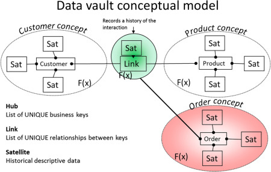
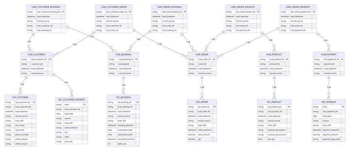
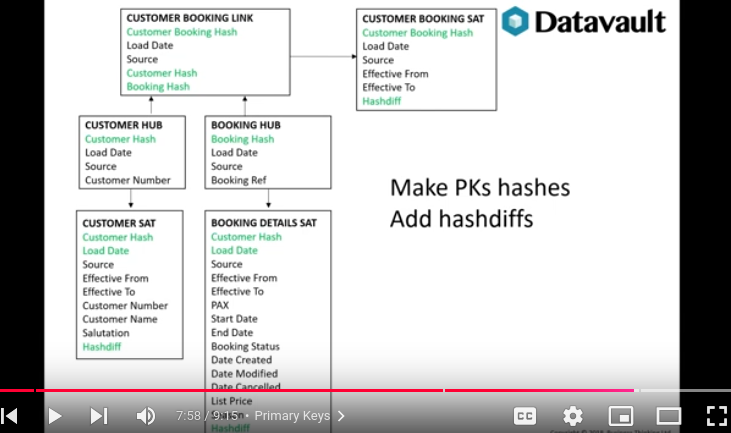
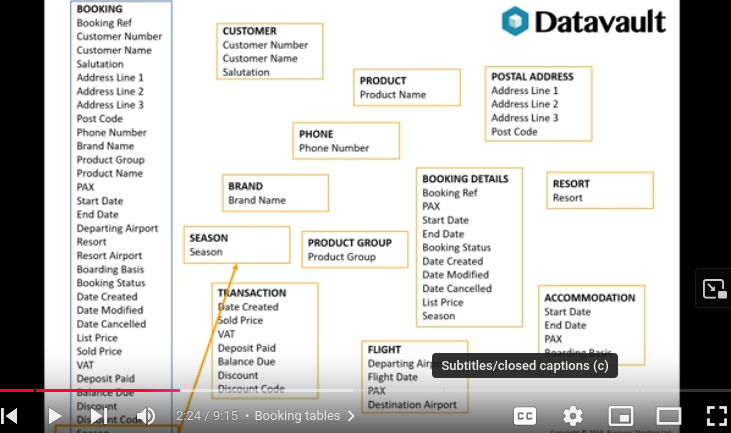

### Data vault modeling : 

Data Vault is a system for modeling your data warehouse in a way that is flexible, scalable, and adaptable to changing business needs. It is a hybrid approach that combines the best aspects of 3NF and star schema. The Data Vault model is composed of three types of tables: hubs, links, and satellites. Hubs are the central business keys, links are the relationships between hubs, and satellites are the descriptive attributes of hubs.

a good example to use data vault modelling when we have a lot of data and we want to make sure that we can easily add new data sources and new data points without having to re-architect our data warehouse.

when we have new sources of customer data should we add them all to dimcustomer table or should we create a new table for each source of customer data?

The answer is that we should create a new table for each source of customer data. This is because each source of customer data will have its own unique business keys and descriptive attributes. By creating a new table for each source of customer data, we can ensure that our data warehouse remains flexible and scalable.

every previous table is a satellite table in the data vault model. The satellite table contains the descriptive attributes of the hub table. In this case, the hub table is the customer table, and the satellite table is the dimcustomer table. The dimcustomer table contains the descriptive attributes of the customer table, such as the customer's name, address, and email address.


Data Vault 2.0

Data Vault 2.0 is a modern approach to data warehousing that aims to provide a scalable, agile, and auditable data model. It was developed by Dan Linstedt and builds on the original Data Vault methodology, enhancing it to better support today’s complex data environments. Data Vault 2.0 addresses the need for handling big data, unstructured data, and a variety of data sources while maintaining data integrity and historical accuracy. As with 3NF, this would sit in your silver layer. It’s not something you would point a BI tool at.



Key Components

    Hubs: Hubs store unique business keys with a unique surrogate key and metadata like load date and source information. Each hub represents a core business concept, such as a customer, product, or order. Hubs are highly stable and rarely change, providing a consistent reference point for the data warehouse.
    Links: Links capture the relationships between business keys stored in the hubs. Each link table contains foreign keys to the relevant hubs, along with metadata. Links represent transactions, associations, or hierarchies between entities. They are used to model many-to-many relationships and changes in relationships over time.
    Satellites: Satellites store descriptive attributes and context for the business keys in hubs or relationships in links. They include metadata for tracking changes over time, such as the load date and source. Satellites can evolve without impacting the core business keys and relationships, allowing for flexible adaptation to new business requirements

    





booking entity include different entities customer, booking, payment, etc.

let's looking for customer and booking details

we use hashing to detect changes in the data vault
using md5 hash function and then check if payload is the same

hash diff is a way to check if the data has changed or not in the data vault
example:
- hash diff between 2 payloads
- if the hash diff is 0, then the data is the same
- if the hash diff is not 0, then the data has changed
- if the hash diff is null, then the data is new
- if the hash diff is null, then the data is deleted
- if the hash diff is null, then the data is updated
- if the hash diff is null, then the data is not changed
- if the hash diff is null, then the data is not changed
```
select 
    hash_diff(md5(payload1), md5(payload2)) as hash_diff
from
    table
```

