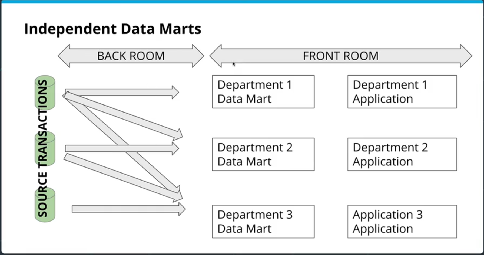

#### Independent Data Marts

Independent Data Marts:
- Often occurs as an ad hoc (unplanned) system
- Still has a 'front room' and a 'back room' like Kimball's bus, but **each department designs its own separate ETL processes for its own data needs**
- Has therefore no conformity between views generated by different departments; can lead to inconsistency
- This model is generally discouraged due to inefficiencies (each ETL by each department is repeating work) and inconsistency.
- This model does however reduce the overhead of coordination and centralized ETL.
  
[&laquo; Previous](Kimball.md) [Next &raquo;](Inmon.md)