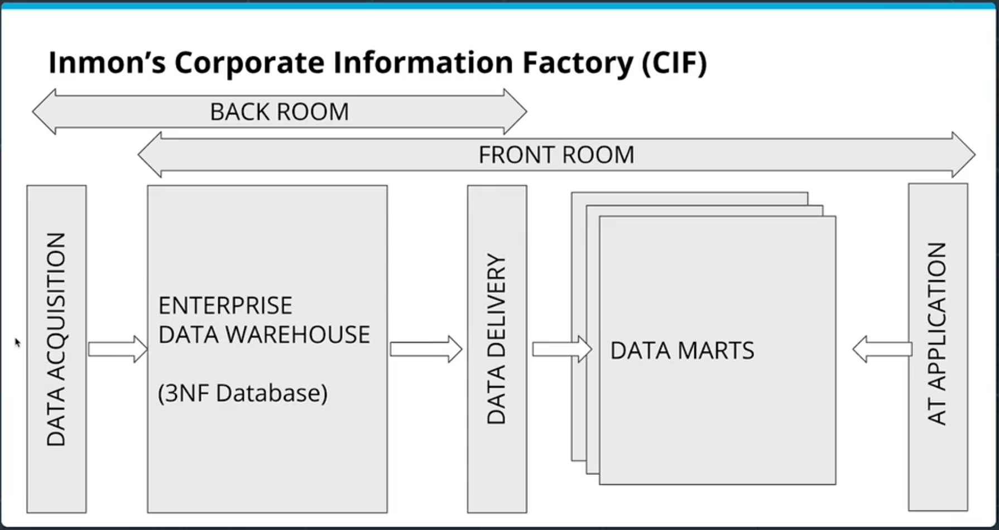
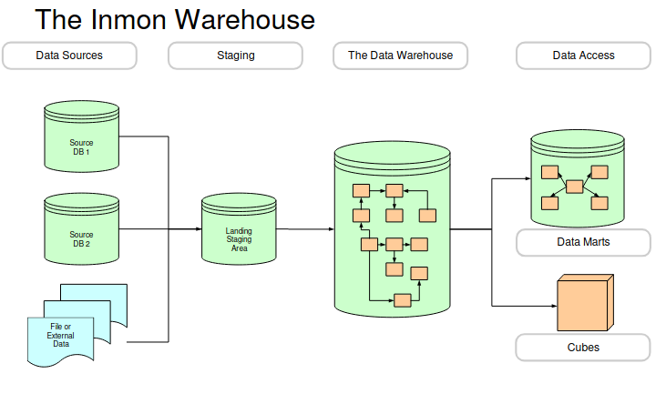
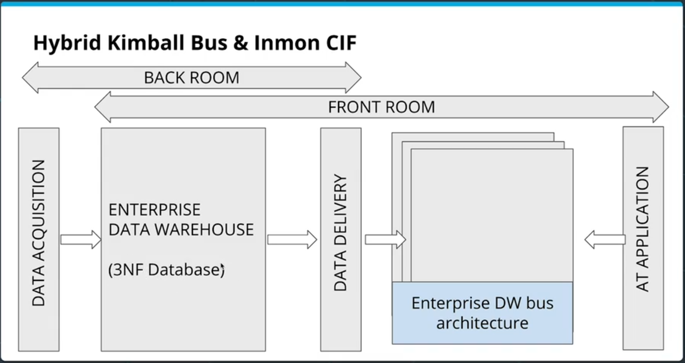

#### Inmon's Corporate Information Factory (CIF)

Inmon's CIF:
- Starts with an ETL to create an intermediate 3NF data warehouse ("Enterprise Data Warehouse") from data acquisition structures
- From this Enterprise data warehouse, data marts are created with another ETL (but data marts are coordinated because they are pulling form same data warehouse)
- This is essentially a balance between Kimball's bus (totally centralized) and the independent data marts (totally de-centralized)
- Analysts can query all data starting with the Enterprise Data Warehouse, including the data marts
  - This gives most transparency and flexibility to analysts to choose the data format that works for them (also increases complexity)
- Data marts are mostly aggregated (no need to have de-aggregated if 3NF database also exists)

---

Getting Started with Choices
* Kimball
Will start with data marts
Focused on quick delivery to users
* Inmon
Will focus on the enterprise
Organizational focus

Kimball vs. Inmon
* Inmon:
  Subject-Oriented
  Integrated
  Non-Volatile
  Time-Variant
  Top-Down
  Integration Achieved via an Assumed Enterprise Data Model
  Characterizes Data marts as Aggregates
* Kimball
  Business-Process-Oriented
  Bottom-Up and Evolutionary
  Stresses Dimensional Model, Not E-R
  Integration Achieved via Conformed Dimensions
  Star Schemas Enforce Query Semantics

#### Hybrid Bus & CIF

Hybrid Bus & CIF:
 - Essentially the CIF model *except* that instead of independent data marts, it uses the shared dimension structure of Kimball's bus

[&laquo; Previous](Independent_Data_Marts.md) [Next &raquo;](OLAP_Cubes.md)
