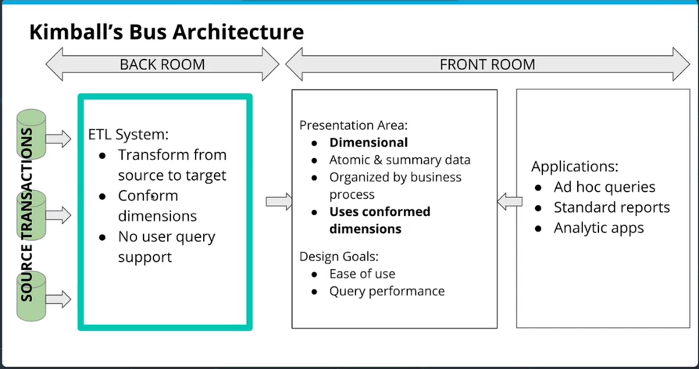
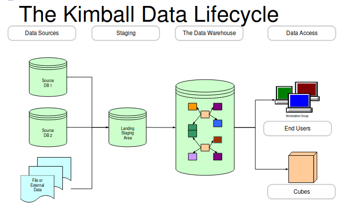
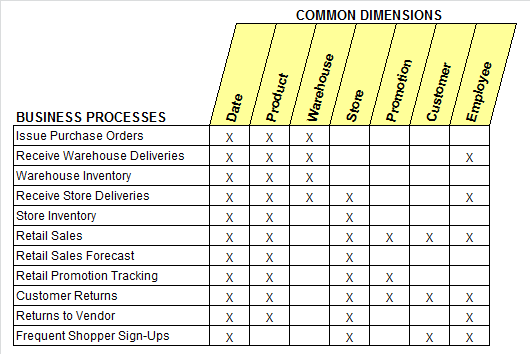

#### Kimball's Bus Architecture

Kimball's Bus Architecture:
- Separates ETL and source transactions (source data) entirely from the presentation of data ("back room" vs. "front room")
- Final data always contains data on the most basic atomic level (i.e., not aggregated) although extra aggregations may also exist.
- Data should be organized according to business processes or departments (focus on end user for data organization)
- Uses "**conformed dimensions**" - across all views and tables, if any dimensions can be used in a standardized way (e.g., date), then all views and tables **use the same** dimension table.
- Design Goals:
  - Ease of use
  - Query performance

Designing a Kimball's Bus can be facilitated by making a simple table of which business units require which dimension tables. It's then possible to see the overlap in needs and therefore whether it's possible to standardize any dimension tables.

Data is moved to staging area
Data is scrubbed and made consistent
From Staging Data Marts are created
Data Marts are based on a single process
Sum of the data marts can constitute an Enterprise Data Warehouse
Conformed dimensions are the key to success

The Kimball Design Approach
Select business process
Declare the grain
Choose dimensions
Identify facts (metrics)

[&laquo; Previous](dimensional_modelling.md) [Next &raquo;](Independent_Data_Marts.md)