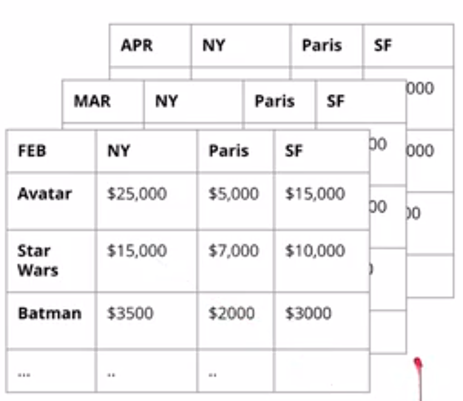

### OLAP Cubes
OLAP cubes are **aggregations of a fact metric on a certain number of dimensions** (e.g., income by city, by brand, by month, etc.). These are essentially cross-tabs from statistics with 2 dimensions. With 3 dimensions (or more), they are represented as *series* of cross-tabs.

OLAP cubes are popular for easily communicating results to business users.



You can also perform additional analyses on OLAP cubes such as:
- **Rolling Up**
  - taking a lower-level dimension (e.g., month) and combining it into a higher-level dimension (e.g., year)
- **Drilling Down**
  - Opposite of rolling up (e.g., year -> month)
- **Slicing**
  - Taking a N-dimension OLAP cube and choosing to only look at certain values of a certain dimension (e.g., dimension == month, but let's look only at March; effectively removes a dimension)
- **Dicing**
  - For one or more dimensions of the OLAP cube, *restrict* the range of values (let's look at movie revenue for March-April and for cities L.A. and N.Y.C.; effectively makes a sub-cube)

OLAP cubes as a data structure therefore need to be able to access *the most granular* ("atomic") data, so that drilling down arbitrarily on different dimensions is possible.

---

>**IMPORTANT**
In many SQL languages, there is a built-in functionality to create OLAP cubes!
`GROUP BY CUBE(movie,city,day)`
This will make one pass through the data and aggregate all *possible* combinations of the specified dimensions.
Providing this 'cube' to business users can speed up analysis (where the alternative is providing the raw dataset for any ad hoc query)

How do we then **serve** these OLAP cubes to users?
1. We **pre-aggregate** the OLAP cubes and save them on a special-purpose non-relational database (Multi-dimensional OLAP; MOLAP)
   1. Often involves using a dedicated OLAP server to serve these data
2. Compute the OLAP cubes **on the fly** from existing relational databases where the dimensional model of data resides (ROLAP)
   1. More popular currently


#### Making accessible ROLAP cubes with columnar storage
Note: We can make ROLAP more efficient by transforming our data to create a new, columnar table extension

- Instructor is using Postgres with an extension [cstore_fdw](https://citusdata.github.io/cstore_fdw/)

```
-- Load extension 1st time after install.
CREATE EXTENSION cstore_fdw;

-- create server object
CREATE SERVER cstore_server FOREIGN DATA WRAPPER cstore_fdw;

-- create foreign table (foreign tables saved in a different format)
CREATE FOREIGN TABLE my_table
(
  customer_id TEXT,
  review_date DATE,
  review_rating INTEGER,
  review_votes INTEGER,
  product_id CHAR(10),
  product_title TEXT,
  similar_product_ids CHAR(10)[]
)

-- Changing server options (might only be necessary if we're loading data from zipped files, as the instructor did)
SERVER cstore_server OPTIONS(compression 'pglz');
```

Note: When the instructor compared the time needed to process the table above vs. the same table made in the normal postgres way, the columnar-style table above was about 27% faster.

>Question: I learned from another Postgres training that we can create different types of indexes to speed up query performance as well. Is it better to use that or move to columnar storage?
> I personally like using Postgres' native functionalities rather than depending on an open-source package which might be harder to depend on.


[&laquo; Previous](Inmon.md) [Next &raquo;](SCD.md)