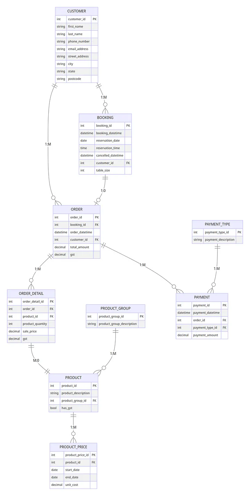
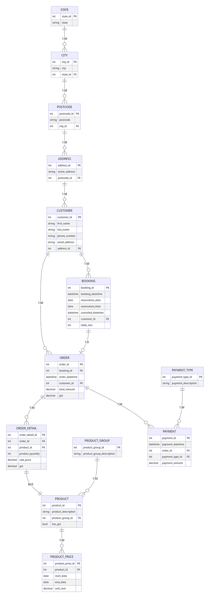
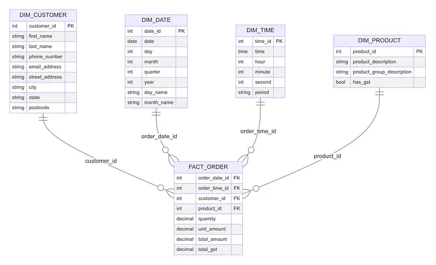
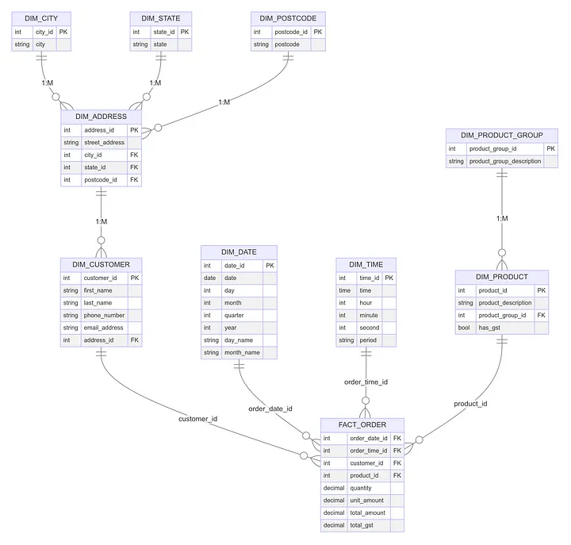
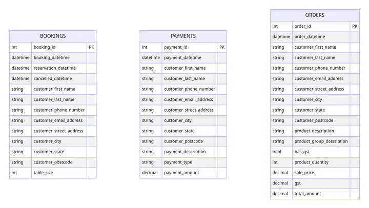
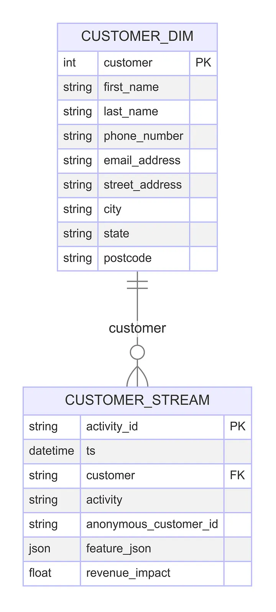
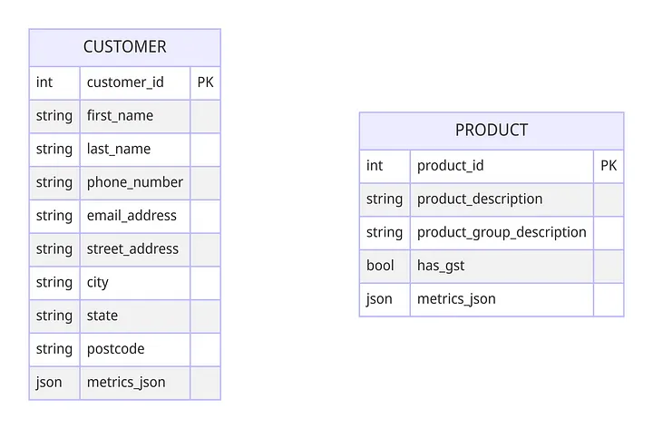

### Base ERD for Sample Restaurant

### 3NF ERD

### Star Schema ERD

Pros:

    Optimised for fast querying by minimising joins
    Intuitive for business users familiar with the business process
    Aggregations are simple to calculate

Cons:

    Denormalization increases data redundancy
    Handling slowly changing dimensions can be tricky
    Less flexible for accommodating future changes

    
Pros:

    Reduces data redundancy and saves storage space
    Enforces data integrity through primary key relationships
    Provides flexibility to accommodate future changes

Cons:

    May require many table joins for analysis, impacting query performance
    Can be complex to understand and navigate for business users

One Big Table (OBT)

The One-Big-Table (OBT) design, also known as a flat table or wide table, is a data warehousing approach where all data is consolidated into a single, denormalized table. This approach contrasts sharply with normalised schemas like the star and snowflake schemas, offering a simpler structure at the expense of increased redundancy and potential performance issues with very large datasets.

Key Components

    Single Table: The core characteristic of the OBT design is that all relevant data is stored in one comprehensive table. This table includes a wide array of columns that capture all the attributes and measures necessary for analysis. The table might contain thousands of columns, with each row representing a unique record encompassing multiple dimensions and metrics.
    Attributes and Metrics: In the OBT design, attributes (typically found in dimension tables in other schemas) and metrics (typically found in fact tables) are combined into a single table. For example, customer details, product information, and sales figures would all be stored in the same table, with each record providing a full snapshot of a transaction or event.

Structure and Design

The structure of the OBT design is straightforward, involving a single table where each row includes all the necessary data points. This flat structure eliminates the need for joins, making it simple for users to query and retrieve data without understanding complex table relationships.

For our restaurant, we would have one large table for each of the three key events — bookings, orders and payments. I’ve seen some fairly heated debates on whether OBT or Star Schema is the better approach. The answer is ‘it depends’. If you’re pulling your data into Power BI, it will expect a Star Schema style dataset. If however you’re pulling the data into Tableau, you might prefer a OBT approach. It should however be noted that if you do opt for OBT, you should keep any reusable logic in supporting tables that can be referenced over and over.

 Activity Schema

The Activity Schema is a data warehousing approach designed by Ahmed Elsamadisi to capture detailed records of business activities or events in a structured and efficient manner. This schema focuses on documenting the actions or transactions performed within a business, making it particularly useful for event-driven data and detailed transaction logging. It has been used in systems that need to track a high volume of granular events, such as e-commerce websites, financial systems, or IoT applications.

Key Components

    Activity Table: The central table in the activity schema is the activity table, which records each business activity or event. Each row in the activity table represents a single event or transaction, capturing details about what happened, when it happened, and other relevant context. This table attributes have been defined as part of the standards, so are easy to implement.
    Dimension Tables: Attached to the activity table is an optional dimension table that provide additional context for the events recorded in the activity table. The dimension might include details about customers, products, locations, time, and other relevant entities depending on the activity stream it relates to.

In our restaurant example, we might have a customer activity table with associated customer dimension. The activity table would track the activities of the customer, such as their bookings, orders and payments. The details of these are held within the feature_json column, with an optional column to store the revenue impact where relevant.

Pros:

    Simple and intuitive design with a very small number of tables
    Additional activities by an entity can be captured without schema change
    New tables are only required when new entities need to be tracked

Cons:

    Relatively new approach without widespread adoption yet
    May not be suitable for all business domains and analysis nee

Entity-Centric Modelling is a flexible approach proposed by Maxime Beauchemin focused on modelling around entities like Customers and Products. Each entity gets its own table, with json used to track an assortment of metrics including aggregates. This approach does not require additional dimension tables as the entity tables are at the lowest grain of the entity, and can contain their attributes directly in the table.

In a restaurant context, we’d have a Customers table with columns for the customer attributes, plus a json column to hold time bound metrics such as visit.7d, visit.14d, sale.30d.

Pros:

    Flexible and adaptable to changing business requirements
    Simple to understand with a small number of tables
    Captures history effectively within the metrics column

Cons:

    Queries can be complex, often requiring unnesting of semi-structured data
    Challenges when entities have overlapping attributes or behaviour types
    More difficult to enforce integrity constraints compared to star schema

 Choosing the Right Modelling Approach

With these seven common data warehouse modelling approaches in mind, how do you choose the right one for your data warehouse? Consider these factors:

    Analytical requirements: What kinds of questions will you need to answer? Choose a model optimised for those query patterns.
    Data volume and scalability: Consider how much data you have now and expect in the future. Some approaches scale better than others.
    Ease of use: Think about who will be querying the data warehouse. Some models are more intuitive for non-technical users.
    Flexibility: Your business is likely to evolve. Choose a model that can adapt to changing requirements.
    Performance: Consider the trade-offs between query speed and data redundancy. Denormalized models are often faster but require more storage.

[&laquo; Previous](Data_vault.md) [Next &raquo;](compare_dwh_architectures)