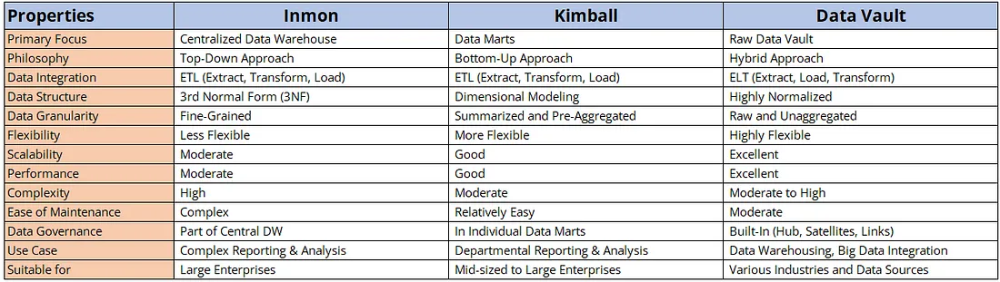

| Aspect | Kimball | Inmon | Data Vault |
| --- | --- | --- | --- |
| Focus | Data marts | centralized Data warehouse | Raw data Vault |
| philosphoy | Bottom-up | Top-down | Hybrid |
| Development | Quick, iterative | Long, structured | Flexible, scalable |
| Data Model | Dimensioal | 3NF | Highly normalized |
| Flexibility | More flexible | Less flexible | Highly flexible |
| User Involvement | High | Low | High |
| Data Quality | Acceptable | High | High |
| Data Governance | Less formal | Formal | Formal |
| Data Integration | Easier | Complex | Easier |
| Scalability | good | moderate | excellent |
| Historical Data | Limited | High | High |
| Implementation | Departmental | Enterprise-wide | Enterprise-wide |
| Business Requirements | Focus on business needs | Focus on data | Focus on data and business needs |
| Data Storage | Data marts | Data warehouse | Data warehouse |
| Data Loading | Batch | Batch | Batch and real-time |
| Data Access | Query-based | Query-based | Query-based and self-service |
|timeframe| slowly changing | continouns & Discrete | continouns & Discrete |
|timeframe method | dimensions key | timestamp | timestamp |

**top-down** approach is more suitable for organizations that have a clear understanding of their business requirements and data sources. It is also ideal for organizations that have a well-defined data model and data governance policies in place. 
the **bottom-up** approach is more suitable for organizations that want to quickly build data marts and provide business users with self-service analytics capabilities. It is also ideal for organizations that have limited data governance policies and want to focus on delivering value to the business quickly.