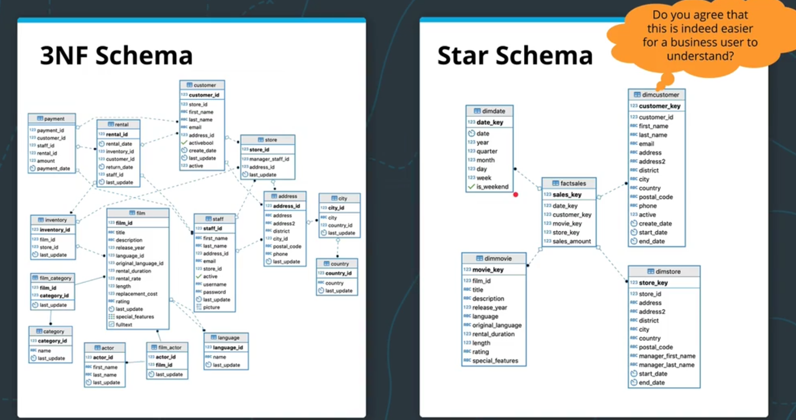

### Recap of dimensional modeling
Third normal form databases are optimized for consistency (rather than speed). For OLTP purposes, this is fine (or even preferable), but for OLAP purposes, we will want to use a de-normalized form, such as a fact & dimension tables.
- **Fact Tables** record business **events**, such as orders, phone calls - stuff that typically symbolizes the relationship between data
- **Dimension Tables** reocrd business **attributes** like individual stores, customers, products, and employees.

However, sometimes it's not always clear what is a *fact* and what is a *dimension*. A simple rule of thumb is **facts are usually numeric and additive**.
For example:
- a review on an article is technically an event, but we can't easily make statistics out of its text content (not a good 'fact')
- invoice numbers might be numeric, but they're not additive (not a good 'fact')
- invoice amount is both numeric and additive (would be a good fact)

Also:
- Date & time are always dimensions
- Physical locations and their attributes are good dimensions candidates
- Products are almost always dimensions

#### Moving from 3rd normal form to fact & dimension tables:
Here's an example from the Udacity course of how you could take a 3NF database and transform it into a de-normalized fact & dimension setup:

[&laquo; Previous](Intro_to_dwh.md) [Next &raquo;](Kimball.md)